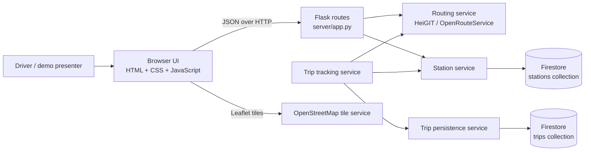

# Architecture and codebase guide

## What the application does

Gas Station Locator is a Flask web app that previews a driving route, finds compatible gas stations near that route, estimates whether they are reachable with the current fuel, and supports a persisted active-trip flow. The browser calls the Flask API; it does not call Firestore or the route provider directly.

The current demo simulates location updates in the browser. It does not use device GPS or vehicle telemetry. Station prices are synthetic estimates, not live pump prices.

## High-level components



The diagram shows responsibilities, not a separate deployed service per box. In this MVP, the Flask app and its Python services run together in one process.

## Request flow

### Preview

1. The browser submits trip inputs to `POST /trip/plan`.
2. `server/services/routing.py` validates fuel and location inputs, geocodes both addresses, and requests a driving route from HeiGIT's OpenRouteService endpoints.
3. The route's GeoJSON coordinates are passed to `server/services/stations.py`.
4. The station service reads compatible fuel records from Firestore, normalizes current and legacy station document formats, filters stations by corridor distance and optional price cap, and attaches each station's nearest point on the route.
5. The browser renders the returned route and candidates. Preview does not create a trip document.

### Start and active trip

1. The browser submits the confirmed inputs to `POST /trip/start`.
2. The backend plans the route again, obtains driving distances to candidate stations, removes stations outside the safe fuel range, and ranks the remaining choices.
3. `server/services/trip_tracking.py` creates the initial state. `server/services/trip.py` assigns an opaque trip ID and random access token, stores only a hash of the token, and writes the trip document to Firestore.
4. The browser keeps the trip ID and token in page memory. It uses the trip returned by `/trip/start` as the active state.
5. Each **Next step** or **Stop & refuel** action sends a progress event to `POST /trip/{trip_id}/progress`. The backend validates the event, updates location/fuel/progress/recommendations, and persists the update.
6. `GET /trip/{trip_id}` can reload state when the client needs it. Progress responses already contain the latest state, so the UI need not GET after each successful progress update.

## Code map

| Path | Responsibility |
| --- | --- |
| `server/app.py` | Flask page and API routes; translates known exceptions into HTTP status/error responses. |
| `server/templates/index.html` | Single-page form, summary, map, timeline, and simulation controls. |
| `server/static/app.js` | Browser state machine, API requests, route interpolation, Leaflet rendering, simulated movement/refueling, and summary updates. |
| `server/services/routing.py` | Trip validation, HeiGIT geocoding/directions/matrix requests, route-corridor station lookup, and safe-station ranking orchestration. |
| `server/services/stations.py` | Firestore station normalization, geographic distance/projection math, nearby and route-corridor filtering. |
| `server/services/recommendation.py` | Fuel-reachability filtering and combined price/detour ranking. |
| `server/services/trip_tracking.py` | Active-trip initialization, fuel/progress calculations, duplicate/stale update handling, off-route logic, rerouting, station refresh, and arrival detection. |
| `server/services/trip.py` | Firestore trip document serialization, creation/read/update, bearer-token validation, and optimistic concurrency. |
| `server/services/getFirebase.py` | Firestore station collection reads, including canonical and legacy fuel-price schemas. |
| `scripts/seed.py` | Validates station CSV records and optionally writes them to the Firestore `stations` collection. Dry-run unless `--apply` is passed. |
| `server/services/build_station_dataset.py` | Builds the supplied type of station dataset from OpenStreetMap data and synthetic prices based on EIA weekly averages. |
| `map_utils.py` | Separate Folium/OSRM HTML-map utility; it is not the map implementation used by the current Flask page. |
| `tests/` | Unit and Flask route tests for validation, routing, station filtering/ranking, trip state, and persistence. |
| `FRONTEND_INTEGRATION.md` | Frontend API sequence and request/response integration guidance. |

## API surface

| Method and path | Purpose | Writes trip state? |
| --- | --- | --- |
| `GET /` | Serve the demo page. | No |
| `GET /health` | Basic process health response. | No |
| `POST /trip/plan` | Preview a route and compatible nearby stations. | No |
| `POST /trip/start` | Re-plan, rank safe stops, and create a persisted active trip. | Yes |
| `POST /trip/{trip_id}/progress` | Apply a GPS event and optional `gallons_added`; return updated state. | Yes |
| `GET /trip/{trip_id}` | Read and authorize an active trip. | No |
| `GET /stations` | Read station documents in Firestore REST format. | No |
| `GET /stations/nearby` | Point-centered station search with fuel/radius/optional price filters. | No |

For request fields, response schemas, and status codes, see [`FRONTEND_INTEGRATION.md`](../FRONTEND_INTEGRATION.md).

## Data and calculations

### Firestore collections

- `stations`: station ID, name, latitude/longitude, fuel type, and price. The seeder uses stable station/fuel IDs so a repeat seed updates the same documents.
- `trips`: active-trip state, including route metadata, fuel/progress state, recommendations, timestamps, and a hash of the trip access token. The raw access token is returned once to the client and is not stored.

Firestore's REST API uses typed values. `server/services/trip.py` encodes and decodes those values. GeoJSON route geometry contains nested coordinate arrays, so the route is persisted as compact JSON text (`route_json`) and decoded back to a route object on reads. This keeps the public API shape map-friendly while avoiding unsupported nested Firestore arrays.

### Station selection

The route corridor is defined by distance to the route polyline. For each candidate, the backend calculates a closest route projection and route progress. It requests driving distances through the route provider, checks whether the station can be reached while preserving a 10% tank reserve, then ranks safe candidates using normalized price and detour scores. A lower combined score ranks first. The point-centered `/stations/nearby` search uses a separate radius query.

### Fuel and cost estimates

- Estimated range = current fuel gallons × vehicle MPG.
- Fuel required for remaining route = remaining route miles ÷ vehicle MPG.
- Safe range = max(0, current fuel − 10% of tank capacity) × MPG.
- Additional gallons needed include the remaining-route estimate and 10% reserve, less current fuel, floored at zero.
- Cost is an estimate using a recommended station's synthetic price as a proxy; it is not a quote.

Fuel use is inferred from route progress and MPG, not measured by a vehicle. A refuel is applied only when the client reports `gallons_added`.

## External services and configuration

- HeiGIT / OpenRouteService: address geocoding, driving directions, and station-distance matrices. Configure the server-side `HEIGIT_API_KEY` in `.env`.
- Firestore REST API: station reads and active trip persistence. Configure `GOOGLE_APPLICATION_CREDENTIALS` with a service-account JSON path and optionally `FIRESTORE_DATABASE_ID` (defaults to `(default)`).
- OpenStreetMap: station source attribution and Leaflet map tiles.
- EIA: California weekly retail averages used as the base for synthetic station prices.

Secrets remain on the server. Do not commit `.env` or service-account files. See `.env.example` and the root README for setup and seed instructions.

## Run and verify

From the repository root:

```bash
uv sync
cp .env.example .env  # first-time setup only; then edit .env
uv run python -m server.app
```

Open `http://127.0.0.1:5000/`. Run the tests with:

```bash
uv run pytest
```

## Current boundaries

- This is a demonstration/MVP, not a production navigation or fuel-payment application.
- The active-trip API accepts real GPS events, but the supplied UI creates simulated events. It does not request location permission.
- No authentication is required for trip preview or station-read endpoints. Active-trip reads/updates use a per-trip bearer token.
- Station and fuel-price quality depend on the seeded dataset; prices are explicitly synthetic and may be stale relative to real pump prices.
- Map tiles and external route services require a working internet connection and valid provider configuration.
