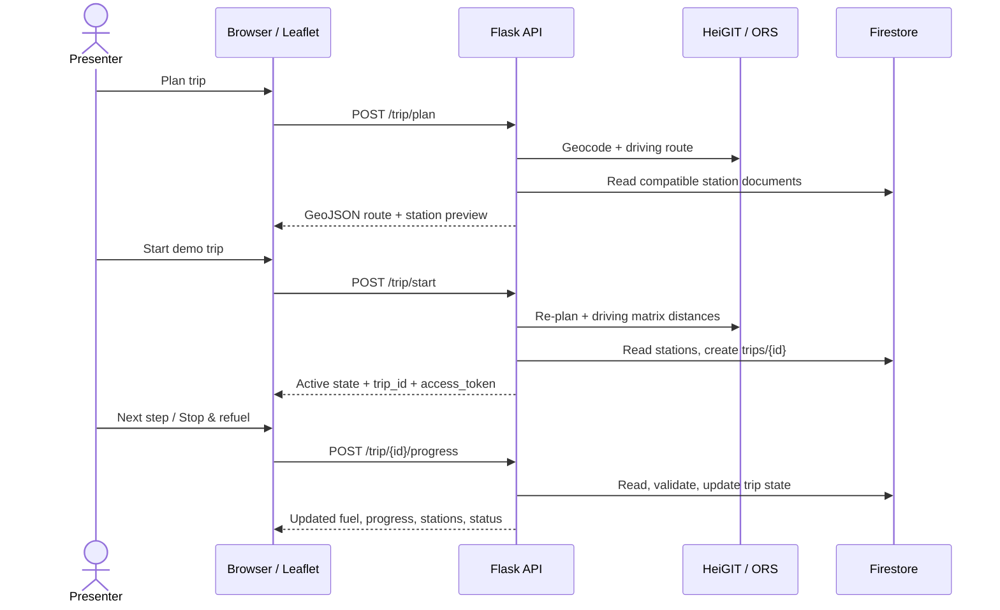

# Technical demo guide

This guide is a presenter-facing walkthrough of the Gas Station Locator demo: what the audience sees, which backend work happens behind each action, and which assumptions to call out.

## Demo message

The app combines a driving route, station data, fuel efficiency, and current fuel to recommend a reachable refueling stop. The trip then advances through a simulated route so the audience can see fuel and station state update without a car or live GPS feed.

The simulation is intentional: it exercises the same progress API used by a GPS client, but the browser generates route points. Estimates are illustrative, not live telemetry, traffic, or pump-price quotes.

## Before presenting

1. From the repository root, make sure dependencies are installed: `uv sync`.
2. Configure `.env` with a valid `HEIGIT_API_KEY` and `GOOGLE_APPLICATION_CREDENTIALS`. Keep both out of Git. `FIRESTORE_DATABASE_ID` is optional and defaults to `(default)`.
3. Confirm the Firebase `stations` collection has station records for the selected fuel. If seeding is needed, review the CSV, run `uv run python scripts/seed.py` as a dry run, then `uv run python scripts/seed.py --apply` to write.
4. Start the current code with `uv run python -m server.app` and open `http://127.0.0.1:5000/`.
5. Test **Plan trip** before the audience arrives. The page needs internet for HeiGIT/ORS and Leaflet/OpenStreetMap tiles.
6. Use the preset CSUEB/Hayward-to-SFO trip or another prepared route. The preset starts with low fuel to demonstrate recommendations. Confirm the selected fuel type has candidate stations and the active-trip service can write to Firestore.

Every **Start demo trip** creates a saved document in Firestore's `trips` collection. Resetting the page clears browser state; it does not delete that document. Avoid unnecessary test starts.

## Suggested 3–5 minute flow

| Beat | Presenter action | What to point out |
| --- | --- | --- |
| 1. Inputs | Show origin, destination, fuel type, MPG, tank capacity, and current fuel. | The starting fuel is user-entered; the demo preset is intentionally low enough to demonstrate a stop. |
| 2. Route preview | Click **Plan trip**. | The UI calls `POST /trip/plan`; the backend geocodes locations, requests a driving route, then returns route geometry and fuel-compatible stations near it. Preview does not save a trip. |
| 3. Start | Click **Start demo trip**. | The UI calls `POST /trip/start`; the backend recalculates the route and reachable station ranking, creates a Firestore trip, and returns a trip ID plus a one-time bearer token. |
| 4. Simulate driving | Click **Next step**. Repeat until the station prompt or arrival. | The UI interpolates a point along route geometry and sends it to `POST /trip/{trip_id}/progress`; the backend calculates route progress and fuel consumed. The marker and estimates update from the response. |
| 5. Refuel | If **Stop & refuel** appears, click it. | This sends `gallons_added` in a progress event. The demo fills to about 75% of tank capacity, subject to tank capacity; this is a reported simulated refuel, not a station transaction. The vehicle marker pauses at the station's route-progress checkpoint; the UI does not simulate the off-route drive to the pump. |
| 6. Finish | Continue with **Next step** until the destination summary appears. | The demo sends destination progress twice because the backend requires two accurate arrivals within 0.1 miles before setting status to `completed`. |

If no recommended stop appears, explain that recommendations are conditional on safe-range reachability and seeded station availability. Do not claim a station was selected if the API returned none.

## System flow behind the UI



The UI uses Leaflet for its interactive map. `map_utils.py` is a separate Folium/OSRM map-generation utility and is not on this page's runtime path.

## What the backend is calculating

The core equations are deliberately explainable:

```text
estimated range       = current fuel (gal) × vehicle MPG
fuel for remaining leg = remaining route miles ÷ vehicle MPG
reserve gallons        = tank capacity × 10%
safe range             = max(0, current fuel − reserve gallons) × MPG
additional gallons     = max(0, fuel for remaining leg + reserve − current fuel)
```

Candidate stations are found near the route, not just near the start point. The backend estimates driving distance from the current location to each candidate and its route projection, rejects candidates outside the current safe range, then combines normalized price and detour scores to rank the reachable set. Recommendations can change after progress, refueling, rerouting, or returning to the route.

The backend uses synthetic station prices built from California weekly EIA averages plus a deterministic per-station variation. The map and card should be described as estimates and comparisons, not real-time gas prices.

## API calls and state

| Action | Endpoint | Presenter-relevant result |
| --- | --- | --- |
| Plan a preview | `POST /trip/plan` | Returns map-ready GeoJSON, route distance/duration, estimated range, and compatible station candidates. Does not write to Firestore. |
| Start the saved simulation | `POST /trip/start` | Returns `trip_id`, `access_token`, route, current location, initial fuel/range/cost estimates, and reachable station recommendations. Writes a `trips` document. |
| Advance / refuel | `POST /trip/{trip_id}/progress` | Updates current location, distance, estimated fuel, station recommendations, optional reported refuel, and trip status. |
| Reload state | `GET /trip/{trip_id}` | Reads the latest saved state using the bearer token. The demo does not need a separate GET after every successful progress call. |

The bearer token stays in browser memory and is sent in the `Authorization` header. Firestore stores its hash, not the raw token. The route is persisted as JSON text because Firestore Standard does not permit arrays directly nested in arrays; API responses still expose a GeoJSON route object.

## Talking points and honest limitations

- “The route and station ranking are backend-derived; the movement is simulated in the UI.”
- “The same progress endpoint can accept GPS from a real client, but this demo does not request location permission or read car telemetry.”
- “Fuel burn is estimated from route progress and the entered MPG. A refuel changes the estimate only when the user reports gallons added.”
- “Prices are synthetic EIA-based estimates, not live pump prices; travel time is a route-provider estimate, not a live traffic forecast.”
- “Station coverage and results depend on the seeded dataset, selected fuel, route corridor, and fuel reserve.”
- “Starting creates a persisted trip. Reset clears the screen only; it does not remove the Firestore document.”

## If the demo misbehaves

- **Preview error:** check the terminal running Flask, `.env`/HeiGIT configuration, internet, and the address text. A valid preview should return HTTP 200 from `/trip/plan`.
- **Start error:** `/trip/start` does more work than preview—it gets route-distance matrices and writes a `trips` document. Check provider availability, service-account project/database, and Firestore write access. Avoid repeated retries if a request timed out; it may have committed.
- **No stations:** verify station documents exist for the selected fuel type and are within the configured route corridor and safe fuel range. The app should not invent a recommendation.
- **Blank map:** Leaflet and OpenStreetMap tiles are loaded over the internet. Check connectivity and browser console/network errors.
- **Need a clean on-screen state:** use **Plan another trip**. Remember this does not delete saved trip records.

For exact payload requirements, API response fields, idempotency, and status-code handling, use [`FRONTEND_INTEGRATION.md`](../FRONTEND_INTEGRATION.md).
